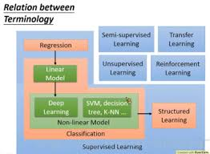
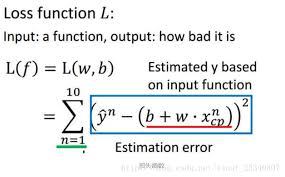

# Machine-Learning-Notes
# 李宏毅机器学习

# Supervised Learning（监督学习）
   - 监督学习**从给定的训练数据集中学习出一个函数，当新的数据到来时，可以根据这个函数预测结果**。监督学习的训练集要求是包括输入和输出，也可以说是特征和目标。训练集中的目标是由人标注的。常见的监督学习算法包括**回归分析**和**统计分类**。
## 1.Regression(回归)
   - The output of the target function F is "scalar(数值)"
   - 应用：
      - Stock market forecast（股市预测）
      - Self-driving Car（自动驾驶）
      - Recommendation（推荐）
   - 例：根据受教育水平，年龄和居住地来预测一个人的年收入
### &emsp;Example Application(应用范例)
   - step1·Model：A set of function
      - Linear model
      - Nonlinear model
   - step2·Goodness of Function（好的功能）
      - Training Data
      - Loss function(损失函数): input:a function,output:how bad it is
   
   - step3·Best Function: Pick the "Best" function
      - Dradient Descent(梯度下降)：Each time we update the parameters,we obtain value that makes L(f) smaller；即找出使L(f)最小的function
         - （Randomly）Pick 按initial value
         - 计算损失函数在某点的微分（偏微分），判断往哪边能使L(f)减小
         - Learning rate（学习速率）：移动的步长
         - problem：
            - Stuck at saddle point
            - Stuck at local minima
      - Local minima(局部最小值)
      - Global minima(全局最小值)
   - generalization(一般化)
      - Testing Data（测试function）
   - Back to step1:Redesign the model(重新设计模型)
      - 当模型需要改进时，可以多次重复该步骤
   - Back to step2:Regularization(正则化)
      - 
### 
## 2.Classification(分类)
### &emsp;(1)Binary(二元)Classification
   - &emsp;&emsp;如垃圾邮件分类
### &emsp;(2)Multi-class(多元) Classification
   - &emsp;&emsp;新闻文章类型的分类
### &emsp;Linear Model
### &emsp;Non-linear Model
#### &emsp;&emsp;Deep Learning
#### &emsp;&emsp;SVM, decision tre, K-NN
## Structured Learning（结构化学习）
# Semi-supervised Learning（半监督学习）
# Unsupervised Learning（无监督学习）
# Transfer Learning（迁移学习）
